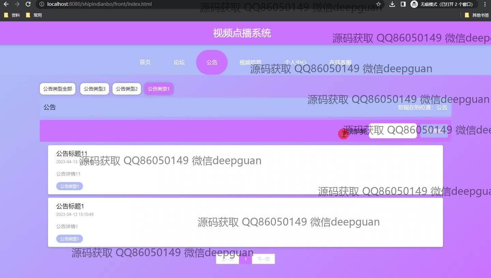
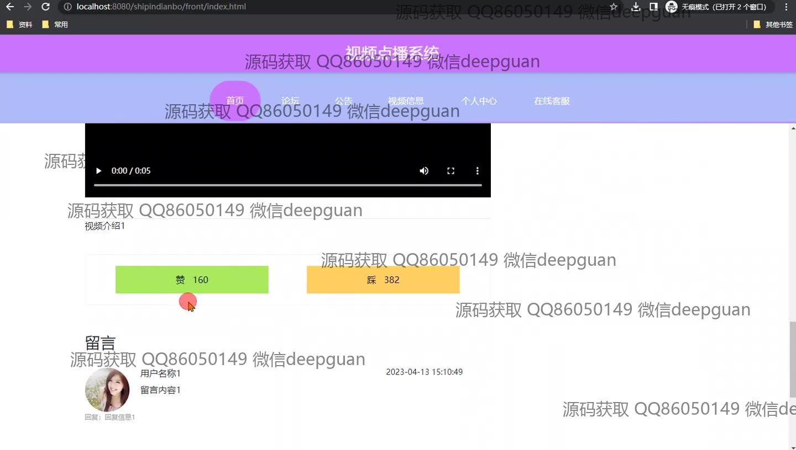
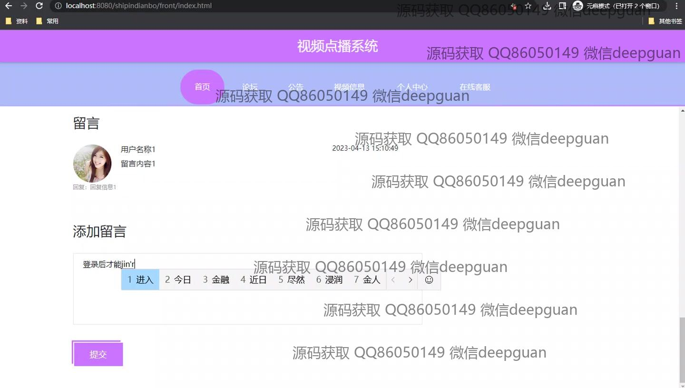
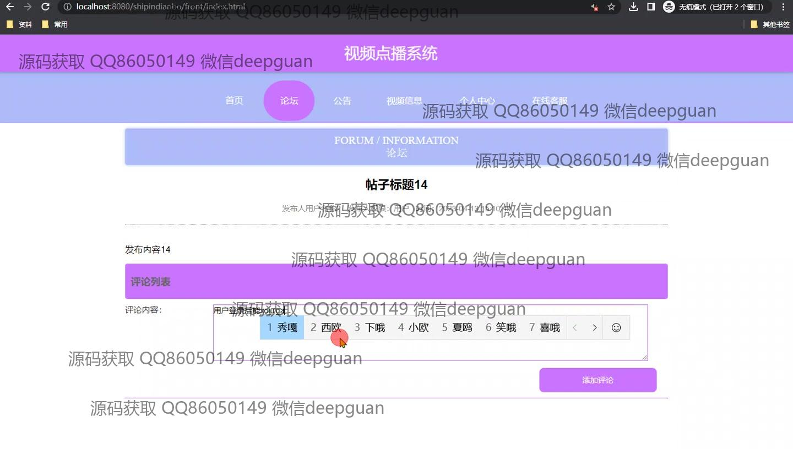
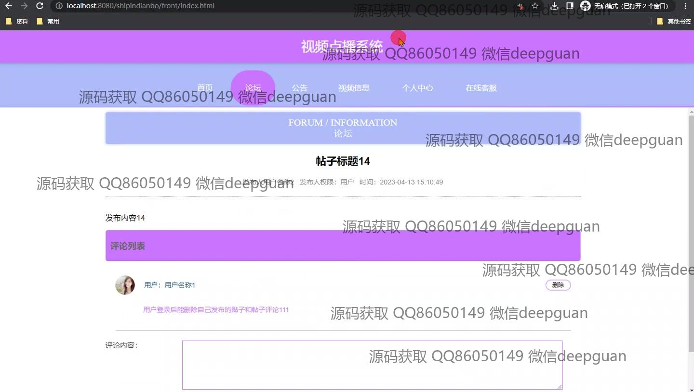
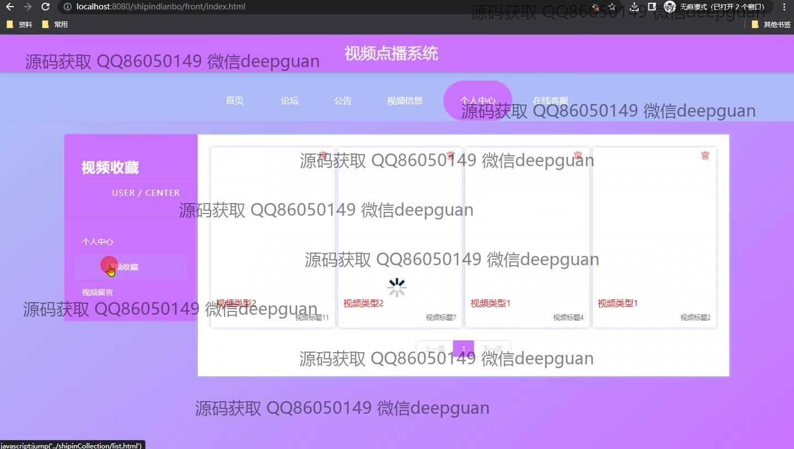
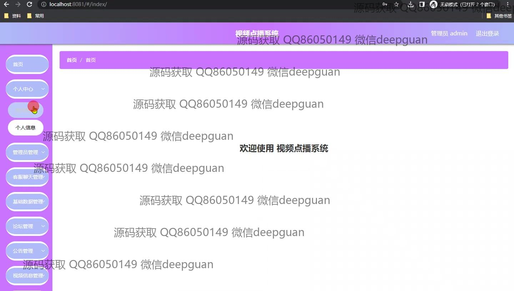
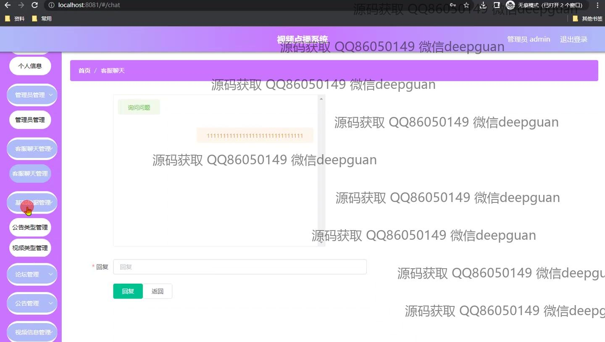
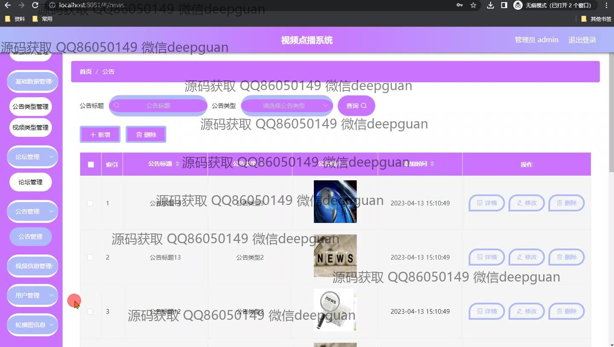
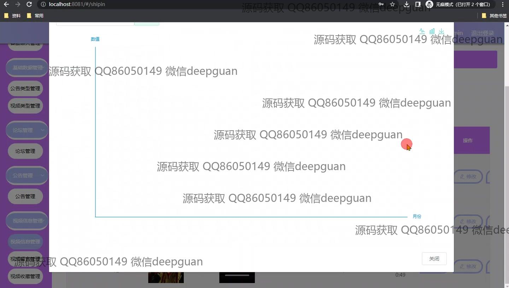

<h1 align="center">基于SpringBoot视频点播系统的设计与实现</h1>

## 简介
基于SpringBoot的视频点播系统：角色分为管理员、用户；提供视频播放、收藏与推荐、论坛互动、公告管理、留言板、用户评论等功能，设计简洁直观，便于用户浏览和管理视频内容与个人信息。    --计算机毕业设计源码；毕设源码；java毕业设计源码

## 联系方式

<h3 align="center">获取完整代码与数据库文件 + 微信：deepguan QQ: 86050149 QQ群: 783742310</h3>

<h3 align="center">可帮忙远程部署 包运行成功！提供远程部署、修改代码、设计文档指导、代码讲解等服务！</h3>

## 功能介绍（完整见运行截图）
管理员： 基本功能包括登录、注册、退出和管理用户信息，支持浏览、编辑、删除及重置密码。首页展示欢迎语，侧重用户管理和视频信息处理，并提供统计数据图表。功能菜单涵盖视频类型、论坛、公告等的管理，支持查看详细信息及进行修改和删除操作。提供客服聊天管理，管理员可以实时与用户进行互动和问题解决。

用户： 基本功能包括登录、注册和退出。用户可以在首页通过导航栏访问论坛、公告、视频信息和个人中心等页面。视频模块支持视频播放，用户可以点赞、踩、收藏或取消收藏，并通过留言板进行互动交流。个人中心允许用户管理视频收藏，查看和删除收藏内容，便于管理自己的观看历史和偏好。

游客： 访问系统无需注册，但只能浏览部分内容。通过主页导航栏查看系统公告、论坛帖子、视频列表等信息。游客可查看视频封面和标题但需注册登录才可观看视频或参与评论和收藏等互动功能。此外，可通过搜索功能查找特定的公告或视频信息。

客服： 主要负责与用户实时沟通，解决用户问题。通过管理界面进行留言管理，查看并回复用户的提问和反馈。支持公告的查询和内容管理，确保用户能及时获取最新的系统信息。运营过程中协助管理员处理用户反馈和系统维护，提升用户体验和系统服务质量。

## 运行截图

本代码来源于网络,仅供学习参考使用!

